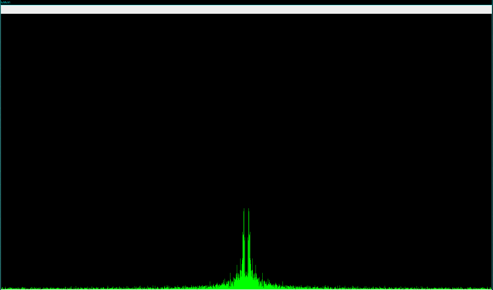

## Music Visualizer

You need create a loopback device (a kind of input mic getting your pc sound output). After that you just run the script and start some sound.

```pip install -r requirements.txt  python luMuVi.py```



